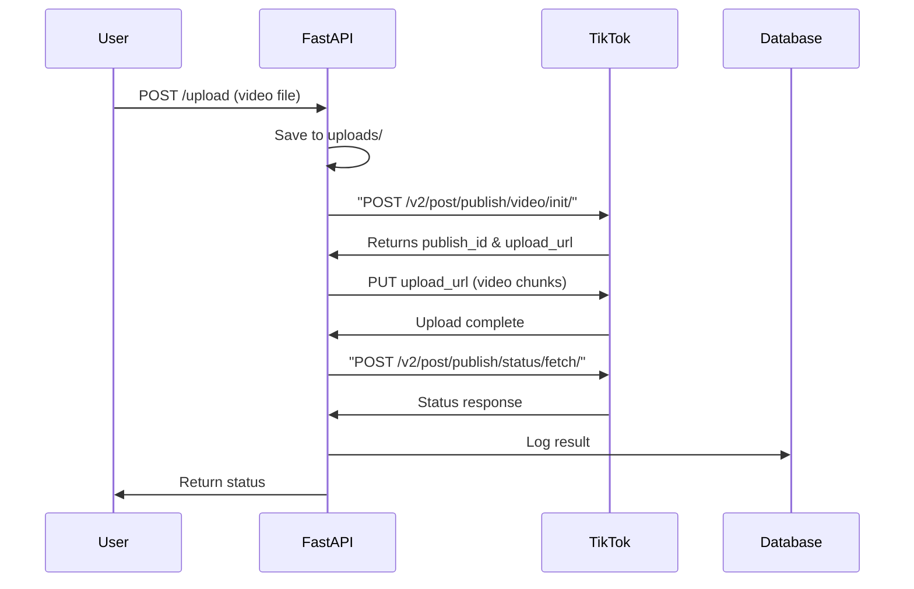

# TikTok Autoposter - Minimal Solution

## Overview

Build a working autoposter that uploads videos to TikTok using the official Content Posting API. Users will upload videos to the FastAPI endpoint, which will automatically post to their TikTok account. This implementation uses `uv` for modern Python dependency management and includes comprehensive unit tests.

## Prerequisites Setup

Before implementation, you'll need:

1. **TikTok Developer Account**: Register at [developers.tiktok.com](https://developers.tiktok.com)
2. **Create an App**: Enable "Content Posting API" permissions
3. **OAuth Token**: Obtain an access token with `video.upload` and `video.publish` scopes
4. **Set Environment Variable**: `export TIKTOK_ACCESS_TOKEN="your_token_here"`
5. **Install uv**: `curl -LsSf https://astral.sh/uv/install.sh | sh` (if not already installed)

## Architecture




## Implementation Steps

### 1. Setup Project with uv

Create `pyproject.toml` with:

- Project metadata (name, version, description)
- Dependencies: `fastapi`, `uvicorn`, `python-multipart`, `requests`
- Dev dependencies: `pytest`, `pytest-asyncio`, `pytest-mock`, `httpx` (for FastAPI testing)
- Scripts for running the app and tests

Benefits of uv:

- Fast dependency resolution and installation
- Creates `.venv` automatically
- Lock file for reproducible builds
- Modern Python tooling standard

### 2. Implement TikTok API Integration in [`tiktok.py`](tiktok.py)

Replace the placeholder with real implementation:

- **Initialize upload**: POST to `/v2/post/publish/video/init/` with video metadata
- **Upload video chunks**: Read video file and PUT to the provided upload URL (chunked for large files)
- **Check status**: POST to `/v2/post/publish/status/fetch/` to verify publication
- **Error handling**: Catch API errors, token expiration, rate limits with clear error messages

Key functions:

```python
def post_video(file_path: str) -> dict:
    # 1. Validate token exists
    # 2. Init upload and get publish_id & upload_url
    # 3. Upload video file in chunks
    # 4. Check and return publication status
```


### 3. Update [`main.py`](main.py)

- Create `uploads/` directory on startup (with `os.makedirs` check)
- Keep existing error handling and logging flow
- Add proper type hints
- Improve error responses with more detail

### 4. Create Comprehensive Unit Tests

**Test structure** (`tests/` directory):

```javascript
tests/
├── __init__.py
├── conftest.py           # Shared fixtures
├── test_main.py          # FastAPI endpoint tests
├── test_tiktok.py        # TikTok API integration tests
└── test_db.py            # Database logging tests
```

**Test coverage**:**`test_main.py`**:

- Test successful video upload and posting
- Test file upload with missing token (should fail gracefully)
- Test invalid file uploads
- Test database logging on success and failure
- Mock TikTok API calls to avoid real API usage in tests

**`test_tiktok.py`**:

- Test `post_video()` with mocked API responses
- Test upload initialization
- Test chunked file upload
- Test status checking
- Test error handling (network errors, API errors, auth failures)
- Test missing access token
- Test invalid file paths

**`test_db.py`**:

- Test `log_post()` function
- Test database table creation
- Test retrieving logged posts
- Use in-memory SQLite for tests

**Test fixtures** (`conftest.py`):

- Mock video file
- Mock TikTok API responses
- Test database
- FastAPI test client

### 5. Environment Configuration

- Update [`tiktok.py`](tiktok.py) to read `TIKTOK_ACCESS_TOKEN` from environment
- Add validation to check token exists before attempting upload
- Raise clear exceptions when token is missing

### 6. Documentation

Create a simple `README.md` with:

- Quick start instructions using uv
- How to obtain TikTok access token
- API endpoint documentation
- How to run tests
- Environment variable requirements

## Key Technical Details

**TikTok API Endpoints** (base: `https://open.tiktokapis.com`):

- Init: `/v2/post/publish/video/init/`
- Status: `/v2/post/publish/status/fetch/`
- Upload: Dynamic URL returned from init

**Required Headers**:

- `Authorization: Bearer {access_token}`
- `Content-Type: application/json` (for JSON requests)
- `Content-Type: video/mp4` (for video upload)

**Video Requirements**:

- Max size: 4GB
- Supported formats: mp4, webm, mov
- Duration: 3s - 10min (varies by region)
- Chunk size for upload: 5-10MB recommended

**Testing Best Practices**:

- Mock all external API calls
- Use fixtures for reusable test data
- Test both success and failure paths
- Aim for >80% code coverage
- Fast tests (no actual video uploads in tests)

## Files Created/Modified

**New files**:

- `pyproject.toml` - Project configuration and dependencies
- `tests/conftest.py` - Shared test fixtures
- `tests/test_main.py` - FastAPI endpoint tests
- `tests/test_tiktok.py` - TikTok integration tests
- `tests/test_db.py` - Database tests
- `README.md` - Project documentation

**Modified files**:

- [`tiktok.py`](tiktok.py) - Real API implementation
- [`main.py`](main.py) - Minor improvements
- [`db.py`](db.py) - Potential improvements for testability

## Running the Project

```bash
# Install dependencies
uv sync

# Run tests
uv run pytest

# Run with coverage
uv run pytest --cov=. --cov-report=term-missing

# Start server
uv run uvicorn main:app --reload
```


## Success Criteria

✓ User can POST video to `/upload` endpoint

✓ Video automatically posts to TikTok account

✓ Database logs the post with status

✓ Clear error messages for failures

✓ Environment variable validates before posting

✓ All unit tests pass with >80% coverage

✓ Tests run quickly without real API calls