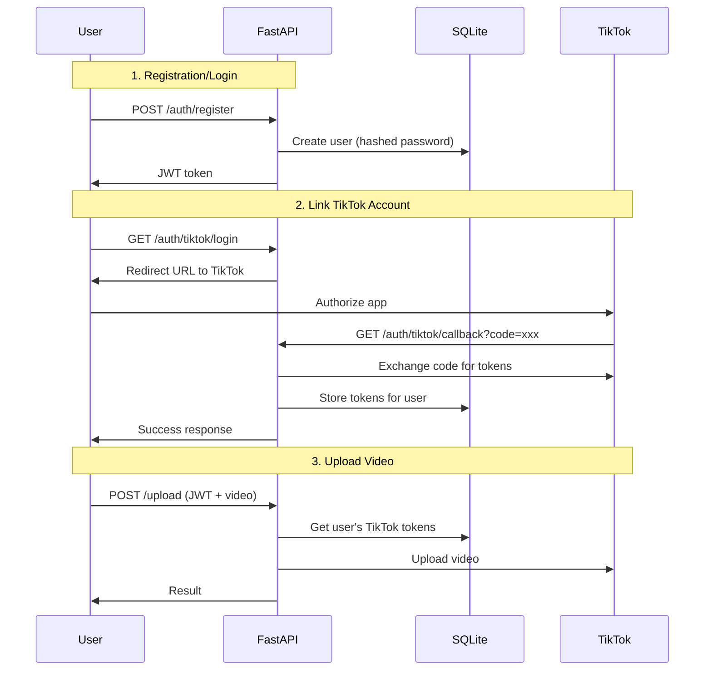

# TikTok OAuth Flow Implementation

## Overview

Add user authentication and TikTok OAuth integration so users can create accounts, link their TikTok, and upload videos through authenticated endpoints.

## Architecture

## Implementation Steps

### 1. Update Database Schema in [`db.py`](db.py)

Add new tables:

- **users**: id, username, password_hash, created_at
- **tiktok_tokens**: id, user_id, access_token, refresh_token, expires_at

### 2. Create Authentication Module (`auth.py`)

- Password hashing with `bcrypt` (via `passlib`)
- JWT token generation/validation with `python-jose`
- Dependency for getting current user from JWT

### 3. Add Auth Endpoints in [`main.py`](main.py)

- `POST /auth/register` - Create new user account
- `POST /auth/login` - Login and get JWT token
- `GET /auth/tiktok/login` - Get TikTok authorization URL
- `GET /auth/tiktok/callback` - Handle OAuth callback, store tokens
- `GET /auth/me` - Get current user info (optional, for testing)

### 4. Update TikTok Module ([`tiktok.py`](tiktok.py))

- Add `exchange_code_for_token()` function
- Modify `post_video()` to accept token as parameter (instead of env var)
- Add token refresh logic (TikTok tokens expire)

### 5. Update Upload Endpoint

- Require JWT authentication
- Fetch user's TikTok tokens from database
- Use user's token for TikTok API calls

### 6. Add Unit Tests

- Test auth endpoints (register, login)
- Test OAuth flow (mock TikTok responses)
- Test protected upload endpoint

## New Dependencies

Add to `pyproject.toml`:

- `passlib[bcrypt]` - Password hashing
- `python-jose[cryptography]` - JWT tokens

## Environment Variables

| Variable | Purpose ||----------|---------|| `TIKTOK_CLIENT_KEY` | Your TikTok app's Client Key || `TIKTOK_CLIENT_SECRET` | Your TikTok app's Client Secret || `TIKTOK_REDIRECT_URI` | OAuth callback URL (e.g., `http://localhost:8000/auth/tiktok/callback`) || `JWT_SECRET_KEY` | Secret for signing JWT tokens |

## API Endpoints Summary

| Method | Endpoint | Auth | Description ||--------|----------|------|-------------|| POST | `/auth/register` | None | Create account || POST | `/auth/login` | None | Get JWT token || GET | `/auth/tiktok/login` | JWT | Get TikTok auth URL || GET | `/auth/tiktok/callback` | JWT (state) | OAuth callback || POST | `/upload` | JWT | Upload video to TikTok |

## Files Changed

- [`db.py`](db.py) - Add users and tokens tables
- [`main.py`](main.py) - Add auth endpoints, protect upload
- [`tiktok.py`](tiktok.py) - Add OAuth token exchange
- `auth.py` - New file for auth utilities
- `pyproject.toml` - Add auth dependencies
- `tests/test_auth.py` - New tests for auth flow

## Security Notes

- Passwords hashed with bcrypt
- JWT tokens have configurable expiry (default 24h)